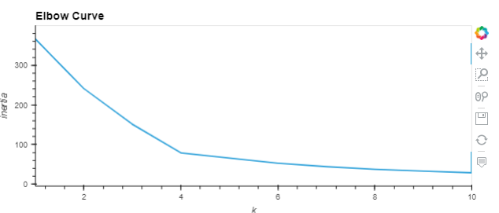
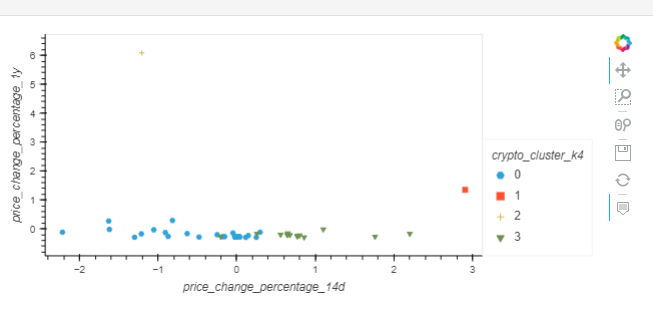
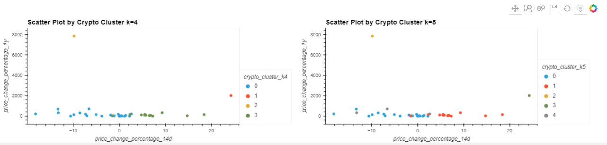

# Challenge10


# Crypto Investments Analysis

This is a Jupyter notebook that clusters cryptocurrencies by their performance in different time periods. The CSV file contains the price change data of cryptocurrencies in different periods. It plots the investment results to show the performance.

---

## Technologies

This project leverages Python 3.7 with the following packages and dependencies:

* [pandas](https://pandas.pydata.org/) - An open-source data analysis and manipulation tool

* [hvplot.pandas](https://hvplot.holoviz.org/user_guide/Introduction.html) - Creates modern and interactive plots and makes it easier to explore the properties of the data

* [pathlib](https://docs.python.org/3/library/pathlib.html) - Used to identify a file using absolute or relative path

* [KMeans](https://scikit-learn.org/stable/modules/generated/sklearn.cluster.KMeans.html) - Clusters data by trying to separate samples in n groups of equal variance, minimizing a criterion known as the inertia

* [PCA](https://scikit-learn.org/stable/modules/generated/sklearn.decomposition.PCA.html) - Linear dimensionality reduction using Singular Value Decomposition of the data to project it to a lower dimensional space

* [StandardScaler](https://scikit-learn.org/stable/modules/generated/sklearn.preprocessing.StandardScaler.html) - Standardizes features by removing the mean and scaling to unit variance

---

## Installation Guide

Python 3.7, GitBash, and JupyterLab are required to be installed before running the application.

---

## Usage

To run the application simply clone the repository and run the **crypto_investments_analysis.ipynb** with:

```python
crypto_investments_analysis.ipynb
```

Attached screenshots below show the different plots

  





---

## Contributors

Brought to you by Christine Guo (www.linkedin.com/in/christine-guo)

---

## License

NoNe